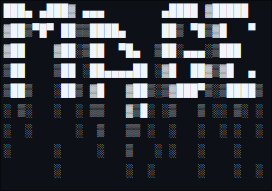

3<figure>

<h6>a cool ascii thing i made</h6>
</figure>
                                    
## Who?
I'm a rando on Github. I code in my freetime (in lua haha) and sometimes help the F.O.S.S world.

## Projects
Nothing yet.

## Programming Languages
* CSS
* Lua & Luau (Don't worry, I'm not a toxic dev ;)
* A little bit of Python
* Some shell script
### Soon to learn or learing
* Perl
* Php?
## Projects
* None (so far)
### Collabs
* None
## Help Wanted
* Nothing
## Special Thanks
(tba)
## Wall of Shame
* i hate git.
